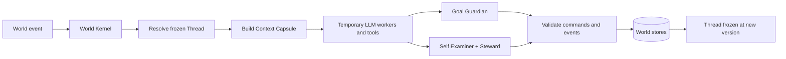

# Architecture diagram

```mermaid
flowchart LR
  E[World event] --> K[World Kernel]
  K --> T[Resolve frozen Thread]
  T --> C[Build Context Capsule]
  C --> W[Temporary LLM workers and tools]
  W --> G[Goal Guardian]
  W --> S[Self Examiner + Steward]
  G --> V[Validate commands and events]
  S --> V
  V --> D[(World stores)]
  D --> F[Thread frozen at new version]
```
